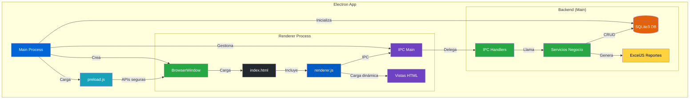

# Sistema de Inventario de Medicamentos

Aplicación de escritorio desarrollada con Electron.js para la gestión de inventario de medicamentos. Permite el control de existencias, seguimiento de vencimientos, registro de entradas y salidas, y generación de reportes.

## 📋 Características

- Gestión completa de medicamentos (CRUD)
- Control de lotes y fechas de vencimiento
- Alertas de stock mínimo y medicamentos próximos a vencer
- Registro de entradas y salidas de inventario
- Generación de reportes en Excel
- Interfaz intuitiva y fácil de usar
- Base de datos SQLite local para almacenamiento seguro de datos

## 🚀 Requisitos del Sistema

- Node.js 14.x o superior
- npm 6.x o superior
- Windows 7 o superior (compatible con otros sistemas operativos con configuraciones adicionales)

## 🛠 Instalación

1. Clonar el repositorio:
   ```bash
   git clone [URL_DEL_REPOSITORIO]
   cd sistema-inventario-medicamentos
   ```

2. Instalar dependencias:
   ```bash
   npm install
   ```

3. Iniciar la aplicación en modo desarrollo:
   ```bash
   npm start
   ```

## 🏗 Estructura del Proyecto

### Diagrama de Arquitectura



### Estructura de Directorios

> 📖 Consulta la referencia completa de archivos en [`docs/estructura_archivos.md`](docs/estructura_archivos.md)


```
sistema-inventario-medicamentos/
├── src/
│   ├── frontend/             # Código del lado del cliente
│   │   ├── css/              # Hojas de estilo
│   │   ├── fonts/            # Fuentes personalizadas
│   │   ├── views/            # Vistas HTML
│   │   ├── index.html        # Página principal
│   │   ├── menu.html         # Menú de navegación
│   │   └── renderer.js       # Lógica del renderer
│   │
│   └── backend/              # Código del servidor
│       ├── services/         # Servicios de negocio
│       └── database.js       # Configuración de la base de datos
│
├── main.js                   # Punto de entrada de Electron
└── package.json              # Configuración del proyecto
```

## 🧩 Tecnologías Utilizadas

- **Frontend:**
  - HTML5, CSS3, JavaScript (ES6+)
  - Bulma CSS Framework
  - Font Awesome para iconos
  - Inter (fuente personalizada)

- **Backend:**
  - Node.js
  - Electron.js
  - SQLite3 (base de datos)
  - ExcelJS (para generación de reportes)

## 🚦 Scripts Disponibles

- `npm start` - Inicia la aplicación en modo desarrollo
- `npm run build:win` - Crea un instalador para Windows
- `npm run build:win-safe` - Versión segura del build para Windows

## 📦 Construcción

Para crear un ejecutable de la aplicación:

```bash
# Para Windows
npm run build:win
```

Los archivos compilados se guardarán en la carpeta `dist/`.

## 📝 Uso

1. **Panel Principal:** Vista general con estadísticas del inventario
2. **Gestión de Medicamentos:** Administre los medicamentos en inventario
3. **Entradas:** Registre nuevas entradas de medicamentos
4. **Salidas:** Registre salidas de medicamentos
5. **Historial:** Consulte el historial de movimientos
6. **Reportes:** Genere reportes en formato Excel
7. **Vencimientos:** Visualice medicamentos próximos a vencer

## ➕ Añadir una Nueva Vista

Sigue estos pasos para agregar una nueva funcionalidad completa (vista + lógica):

1. **Crear la Vista HTML**
   - Copia un archivo de `src/frontend/views/` como plantilla o crea uno nuevo, p. ej. `mi_feature.html`.
   - Estructura básica Bulma: `<div class="box"> … </div>`.
   - Agrega _ids_ y clases a los elementos que necesites manipular desde JavaScript.

2. **Actualizar el Menú** (`src/frontend/menu.html`)
   - Añade un enlace en la lista `<a data-view="mi_feature.html">Mi Feature</a>`.
   - El `renderer.js` cargará la vista automáticamente al hacer clic.

3. **Añadir Lógica en el Renderer**
   - Crea (o amplía) un archivo JS dedicado en `src/frontend/js/` (si prefieres mantener separados) o agrega funciones en `renderer.js` dentro del bloque de rutas:
     ```js
     case 'mi_feature.html':
       cargarMiFeature();
       break;
     ```
   - Implementa `cargarMiFeature()` para inicializar eventos y llamar a IPC.

4. **Crear un Service en Backend**
   - En `src/backend/services/` crea `miFeatureService.js` que exporte las funciones necesarias (CRUD o consultas).

5. **Registrar Handlers IPC**
   - Crea `src/backend/ipcHandlers/miFeatureHandlers.js`:
     ```js
     function registerHandlers(ipcMain, db) {
       ipcMain.handle('miFeature:list', async () => {
         return miFeatureService.list(db);
       });
     }
     module.exports = { registerHandlers };
     ```
   - Importa y registra en `main.js`:
     ```js
     const { registerHandlers: registerMiFeatureHandlers } = require('./src/backend/ipcHandlers/miFeatureHandlers');
     // dentro de app.whenReady()
     registerMiFeatureHandlers(ipcMain, db);
     ```

6. **Conectar con la Base de Datos (opcional)**
   - Si necesitas tabla nueva, añade `CREATE TABLE IF NOT EXISTS` en `database.js`.
   - Usa consultas en tu `miFeatureService.js` para leer/escribir datos.

7. **Actualizar Documentación**
   - Añade tu vista en `docs/estructura_archivos.md`.
   - Si creas tablas nuevas, documenta el esquema.

> Consejo: reutiliza componentes Bulma y sigue la convención de nomenclatura para mantener coherencia.

---

## 📊 Base de Datos

La aplicación utiliza SQLite3 para el almacenamiento local de datos. La base de datos se crea automáticamente en:
- Windows: `%APPDATA%/[app-name]/inventario.sqlite`
- En desarrollo: `./data_dev/inventario.sqlite`

## 🎨 Personalización

### Colores
La paleta de colores personalizada incluye:
- Color primario: `#36D9D9` (cyan claro)
- Color de éxito: `#035AA6` (azul oscuro)

### Fuente
La aplicación utiliza la fuente 'Inter' para una mejor legibilidad.

## 🔒 Seguridad

- Content Security Policy (CSP) implementada
- Validación de entrada en formularios
- Manejo seguro de rutas de archivos

## 📄 Licencia

Este proyecto está bajo la licencia propietaria (revisar repositorio oficial).


## 🤝 Contribución

Las contribuciones son bienvenidas. Por favor, envíe un Pull Request con sus cambios propuestos.

## 📧 Contacto

Para soporte o consultas, por favor contacte al equipo de desarrollo.
